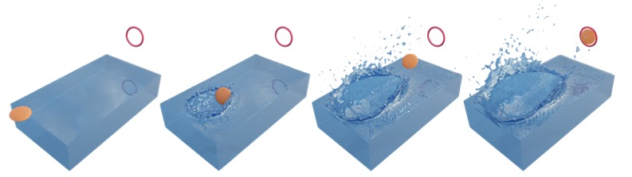

# DiffFR: Differentiable SPH-based Fluid-Rigid Coupling for Rigid Body Control



## 1. Introduction
This is the code base for our SIGGRAPH Asia 2023 paper. 
We develop our method based on the open-source library [SPlisHSPlasH](https://github.com/InteractiveComputerGraphics/SPlisHSPlasH) and we sincerely thank the effort of its authors. 

## 2. Installation
We have built and tested the code on Ubuntu22.04. 

### 2.1 Prerequisite

Required infrastructures can be installed via: 

```
sudo apt install git cmake xorg-dev freeglut3-dev build-essential libomp-dev
```

Required python packages can be directly installed by `pip install -r requirements.txt`. 


### 2.2 How to build 
First shallow clone this repo with git:
```
git clone --depth=5 git@github.com:zhehaoli1999/DiffFR.git 
```
Then we recommend to create a new conda environment (such as "diffFR") and
activate it:
```
conda create --name diffFR python=3.7
conda activate diffFR
```
Then find `build.sh` under the root dir of the project, and  use commands like `bash build.sh` to execuate this shell (please ensure your
shell has already execuated `conda init`). It will use cmake to configure the
project and then compile it with your compiler. 

## 3. Experiments in paper
**You can find all raw data records and the scripts for figure plotting of our experiments in the `experiments` folder.**

The simulation scene settings are described as json files, and the initial setting of velocities and positions of fluid and rigid particles are stored as bgeo and binary files. 

To run each task, you need to input a scene json file, as well as an optional binary file of the initial settings of the fluid environment (without specification, all fluid particles will have the positions described in the json file with zero velocities. )

### 3.1. Rigid body trajectory optimization


#### Data
| Task                      | Scene json file                | state file                  | taskType         | design variables | notes                                           |
|---------------------------|--------------------------------|-----------------------------|------------------|------------------|-------------------------------------------------|
| water rafting             | diff-water-rafting-bunny.json  | water_rafting/state_130.bin | 'water-rafting'  | vx, vz omega     | load-fluid-pos-and-vel                          |
| high diving               | diff-high-diving-duck.json     | high_diving/state_98.bin    | 'high-diving'    | omega            | load-fluid-pos                                  |
| stone skipping            | diff-stone-skipping.json       | stone_skipping/state_18.bin | 'stone-skipping' | v, omega         | load-fluid-pos                                  |
| bottle flipping (stage 1) | diff-bottle-model.json         | bottle_flip/state_54.bin    | 'bottle-flip'    | v, omega         | load-fluid-pos                                  |
| bottle flipping (stage 2) | diff-bottle-model-collide.json | bottle_flip/state_54.bin    | 'bottle-flip'    | v, omega         | load-fluid-pos                                  |
| on-water billiards        | billiards-on-water-2balls.json | billiards/state_17.bin      | -                | v, omega         | use `diff-rigid-contact-multi.py`, load-fluid-pos |


#### Commands to run

First, `cd ./experiments/rigid_body_trajectory_optimization/python`.

For gradient-based optimization (ours), use `gradient-based-optimize.py`. For gradient-free optimization (CMA-ES & 1+1 ES), use `opt-ng.py`.

+ bottle flipping
```
python gradient-based-optimize.py --scene=../scene/diff-bottle-model.json --state=../state/bottle_flip/state_54.bin  --load-fluid
-pos --taskType=bottle-flip
```
+ stone skipping
```
python gradient-based-optimize.py --scene=../scene/diff-stone-skipping.json --state=../state/stone_skipping/state_18.bin  --load-fluid
-pos --taskType=stone-skipping
```

+ water rafting
```
python gradient-based-optimize.py --scene=../scene/diff-dambreak-bunny.json --state=../state/water_rafting/state_130  --load-fluid
-pos-and-vel --taskType=water-rafting 
```

+ high diving
```
python gradient-based-optimize.py --scene=../scene/diff-high-diving-duck.json --state=../state/high_diving/state_98.bin   --load-fluid
-pos --taskType=high-diving
```

+ on-water billiards
```
python diff-rigid-contact-multi.py --scene=../scene/billiards-on-water-2balls.json --state=../state/billiards/state_17.bin  --load-fluid-pos
```

### 4.2. Self-supervised bottle flipping control policy 

#### Commands to run
First, `cd ./experiments/bottle_flip_robot/python`
```
python bottle-flip-robot.py --scene=../scene/diff-bottle-model-360degree.json --state=../state/state_1.365999.bin --load-fluid-pos
```

### 4.3. On-water inverted pendulum robot controller

#### Commands to run 
First, `cd ./experiments/on_water_inverted_pendulum/python`

Train:
```
python cartpole-diff-controller.py --scene=../scene/cartpole-diff-controller.json --state=../state/state_0.879992.bin --load-fluid-pos
```
Test: 
```
python cartpole-diff-controller.py --scene=../scene/cartpole-diff-controller.json --state=../state/state_0.879992.bin --load-fluid-pos --test=../saved_models/success8s-2023-01-14-23:07:05-cartpole-epoch6.pth`
```
### 4.4. Other comparison & ablation experiments 

Please see the content of `./experiments/others` for code and raw data. 

## 5. Postprocess & Rendering 

For postprocess we use Houdini to reconstruct the fluid surface mesh from particles, and use Blender Cycles for rendering. 

## 6. Contact & citation 
If you have any question, please feel free to open an issue or email `zhehaoli@mail.ustc.edu.cn`. 

To cite our paper, here is the bibtex:
```
@article{10.1145/3618318,
author = {Li, Zhehao and Xu, Qingyu and Ye, Xiaohan and Ren, Bo and Liu, Ligang},
title = {DiffFR: Differentiable SPH-Based Fluid-Rigid Coupling for Rigid Body Control},
year = {2023},
issue_date = {December 2023},
publisher = {Association for Computing Machinery},
address = {New York, NY, USA},
volume = {42},
number = {6},
issn = {0730-0301},
url = {https://doi.org/10.1145/3618318},
doi = {10.1145/3618318},
journal = {ACM Trans. Graph.},
articleno = {179},
numpages = {17}
}
```
## 7. License
MIT License
